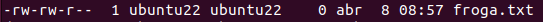
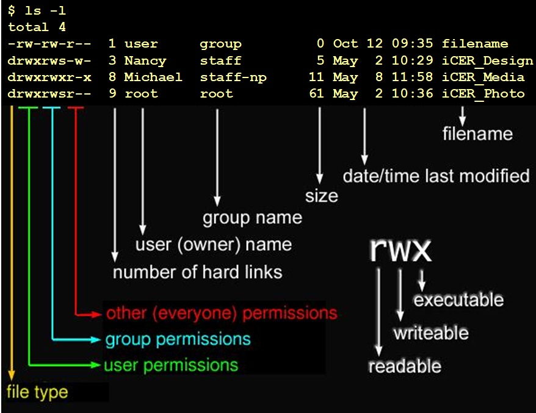

# Baimenak Linux
- [Baimenak Linux](#baimenak-linux)
  - [Fitxategi eta direktorioen baimenak](#fitxategi-eta-direktorioen-baimenak)
    - [Baimen taldeak](#baimen-taldeak)
    - [Baimenak esleitzen modu sinbolikoan](#baimenak-esleitzen-modu-sinbolikoan)
    - [Baimenak modu oktalea](#baimenak-modu-oktalea)
  - [Sticky bit baimena](#sticky-bit-baimena)
  - [SUID eta GUID baimenak](#suid-eta-guid-baimenak)
    - [SUID](#suid)
- [Ariketak](#ariketak)
  - [Ariketa 1](#ariketa-1)
  - [Ariketa 2](#ariketa-2)
  - [Ariketa 3](#ariketa-3)
  - [Ariketa 4](#ariketa-4)
  - [Ariketa 5](#ariketa-5)
  - [Ariketa 6](#ariketa-6)
  - [Ariketa 7](#ariketa-7)

## Fitxategi eta direktorioen baimenak

Fitxategi eta direktorioen baimenak hurrengo aginduarekin ikusi ditzakegu.

```bash
ls -a
```



### Baimen taldeak

**- Jabea (user)** : Fitxategi bat sortzen dugunean, sortzailea jabea izango da defektuz.
**- Talde (group)** : Fitxategi baten jabetza talde bati ere bai dagokio.
**- Besteak (other)** : Jabeak edo taldekideak ez direnak.



### Baimenak esleitzen modu sinbolikoan

Linux-en baimen motak eta `chmod` aginduaren erabilera hainbat motatan azaltzen dira. Hemen daude batzuk:

1. **Baimen motak:** Linux-en, fitxategi edo direktorio bakoitzak hiru baimen mota izan ditzake: "owner" (jabea), "group" (taldea) eta "others" (besteak). Baimen hauek aldatu daitezke, erabiltzaileak eta taldeak fitxategi edo direktorioetan zer egin ahal izateko.

2. **`chmod` agindua:** `chmod` agindua baimenak aldatzeko erabiltzen da. Agindu hau erabiltzean, hiru baimen moten balioak aldatu daitezke: "read" (irakurri), "write" (idatzi) eta "execute" (exekutatu). 

3. **Fitxategi eta direktorioen baimenak aldatzea:** Adibidez, `chmod` agindua erabiliz, fitxategi bati exekutatzeko baimena eman dezakegu erabiltzaileari bakarrik (`chmod u+x fitxategia`), edo talde guztiei idazteko baimena kendu dezakegu (`chmod g-w fitxategia`).

4. **Simbolo eta zenbaki notazioa:** `chmod` agindua hiru hizkuntza notazioetan idaz daiteke: simbolikoa eta zenbakizkoa. Simbolikoak ("r", "w", "x") irakurri, idatzi eta exekutatu baimenak adierazten ditu, eta "u" (erabiltzailea), "g" (taldea) eta "o" (besteak) erabiltzaile, talde edo besteak diren baimenak aldatzeko erabiltzen dira. Zenbakizko notazioak baimenak 3 bitetan adierazten ditu: "read" (4), "write" (2) eta "execute" (1).

5. **Erabilienezko adibideak:** `chmod 755 fitxategia` fitxategiari irakurri, idatzi eta exekutatzeko baimena ematen dio erabiltzaileari eta taldeari, eta exekutatzeko baimena besteei. `chmod u=rw,go=r fitxategia` erabiltzeko, fitxategia irakurri eta idatzi baimenak ematen zaizkie jabeak, eta beste guztiei irakurri baimena.

`chmod` aginduaren erabilera hauen laguntzarekin, Linux sistema eragileetan baimenak nola kudeatu ikasten da, fitxategiak eta direktorioak seguruak eta egokiak mantentzeko.

Adibidez, jabeari (user) exekuzio baimena horrela eman ahal izango diogu.
```bash
chmod u+x froga.txt
```

Horrela, taldeari eta besteei exekuzio eta idazteko baimenak emango dizkiegu.
```bash
chmod go+wx froga.txt
```

Besteei, irakurtzeko baimena horrela kendu ditzaiokegu.
```bash
chmod o-r froga.txt
```

### Baimenak modu oktalea

- 0 = 000 = --- = Baimenarik gabe.
- 1 = 001 = --x = Exekuzioa.
- 2 = 010 = -w- = Idazteko.
- 3 = 011 = -wx = Idazteko eta exekutatzeko baimena.
- 4 = 100 = r- = Irakurtzeko baimena.
- 5 = 101 = r-w = Irakurtzeko eta exekutatzeko baimena.
- 6 = 110 = rx- = Irakurtzeko eta idazteko baimena.
- 7 = 111 = rwx = Baimena guztiak.

Adibidez baimen guztiak kentzeko.
```bash
chmod 000 froga.txt
```

Baimen guztiak gehitzeko.
```bash
chmod 777 froga.txt
```

Erabiltzaileari baimen guztiak emateko eta besteei edo taldekidei irakurtzeko eta exekuzio baimena emateko. 
```bash
chmod 755 froga.txt
```
## Sticky bit baimena

Sticky bita daukan fitxategia edo direktorioa bat bakarrik jabea edo rootek aldatu ahal dio izena edo ezabatu ahal du.

Sticky bita gehitzeko.
```bash
chmod +t froga.txt
```


## SUID eta GUID baimenak

### SUID

SUID aktibatuta dagoenean fitxategi hau exekutatzen duen erabiltzaileak sortzailearen baimenak izango ditu.

```bash
chmod u+s froga.txt
```

Sortu exekutable bat root bezala, hurrengo edukiarekin eta izena.

suidfroga.sh
```bash
#!/bin/bash
id
echo exeku 
echo $EUID
```

Baimenak esleituko dizkiogu fitxategiari.
```bash
chmod 755 suidfroga.sh
```

Ezarri SUID suidfroga.sh fitxategiari.

```bash
chmod u+s 
Alde batetik baimenak S x ed exekuzioa bezala idatzi.

Erabiltzaileen baimentan S badago 4755

Taldeen baimentan s badago 2755

Sticki bita badago "t" 1755

r-srwx--
570-> 4570

r-rws---
470-> 2470

r--rwx--t
470-> 1470

r--rws--t
470-> 2470-> 3470

## Ezaugarri bereziak - lsattr eta chattr

Ezaugarri bereziak ikusteko `lsattr` agindua erabiliko dugu

Ezaugarri bereziak aldatzeko `chattr` agindua erabiliko dugu

Adibidez, i atributoaren fitxategi bat inmutable bilakatzen dugu. Hau esan nahi du, inork ezin duela aldatu, ez ezabatu, ez root-ek. Ezabatu nahi izatekotan, i atributua kendu beharko genioke lehenengo.

```bash
chattr +i froga.txt
lsattr froga.txt
```

![alt text]

- **u** ezaugarriarekin fitxategi bat ezabatzen dugunean, datuak gordeta gelditzen dira eta bere berreskurapena ahalbidetzen du.

```bash
chattr +u froga,txt
```

- **e** ezaugarriarekin fitxategi bat ezabatzen denean, okupatzen zuen memoria zeroarekin berridazten da.
  
```bash
chattr +e froga.txt
```

- **c** ezaugarriarekin fitxategi bat konprimituta gordeko da.
```bash
chattr +c froga.txt
```

- a ezaugarriarekin fitxategi bati bakarrik gehitu ahal zaizkio gauzak, hau da, ezin da aldatu aurretik zegoen ezer.
```bash
chattr +a froga.txt
```

# Ariketak

## Ariketa 1

lotu dagokion baimenarekin

- 462
- 123
- 711
- 333
- 161
- 765
- 567
- 101
- 162
  
- rwx--x--x
- --x-w--wx
- --x-----x
- -wx-wx-wx
- r-xrw-rwx
- rwxrw-r-x
- --xrw--w-
- r--rw--w-
- --xrw---x

-462=r--rw--w-
-123=--x-w--wx
-711=rwx--x--x
-333=-wx-wx-wx
-161=--xrw--w-
-765=-rwxrw-r-x
-567=r-xrw-rwx
-101=--x-----x
-162=--xrw--w-

## Ariketa 2

Zein da fitxategi honen baimenen baimena modu oktalean?
![alt text]

- r--rw-r--=546

## Ariketa 3

Jarri hurrengo baimenak modu oktalean

- r--r-xrw-
- --xr-xr--
- r--------
- --------x
- rwsr-xr-x
- rwxr-sr-x
- r--rw---t

-: r--r-xrw-=456
-: --xr-xr--=154
-: r--------=400
-: --------x=1
-: rwsr-xr-x=4755
-: rwxr-sr-x=2755
-: r--rw---t=1460

## Ariketa 4

Zer gertatuko da hurrengo agindua exekutatzerakoan?
![alt text]

1-'Whoami' komandoaren output-a file fitxategian gordeko da, fitxategiaren jabea izateagatik baimenek ez baitidate eragiten

**2- 'Whoami' komandoaren output-a ezin izango da file fitxategian gorde, jabea izan arren, fitxategian esleitutako baimena gailentzen delako**

## Ariketa 5

Nola lortuko zenuke "file" artxiboaren baimenak ikusten den moduan aldatzeko?
![alt text]

chmod 471

## Ariketa 6

Zortzitarrean zer baimen esleitu beharko dut artxiboak adierazitako baimenak izan ditzan lortzeko?
![alt text]

- chmod 625
  
## Ariketa 7

Honako baimen hauek konfiguratuta dituen fitxategi hau ezabatu ahal izango dut?
![alt text]

**1. Bai**
2. Ez